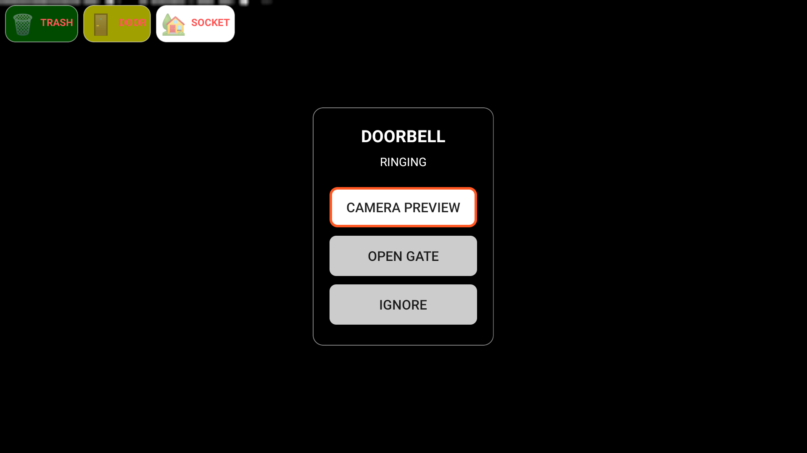

# PiPup – Android TV overlay for Home Assistant

PiPup is an Android TV overlay service that can display rich popups over any app.  
This fork extends the original project with **Home Assistant–friendly features** like: 
- notification sounds
- persistent tiles
- actionable buttons
- **camera control popup with PTZ**.


---

## Table of contents

- [Overview](#overview)
- [Original features](#original-features)
- [Enhancements in this fork](#enhancements-in-this-fork)
- [Installation](#installation)
- [Home Assistant integration](#home-assistant-integration)
  - [Basic popup](#basic-popup)
  - [Persistent notifications panel](#persistent-notifications-panel)
  - [Actionable popups](#actionable-popups)
  - [Camera Control popup (PTZ)](#camera-control-popup-ptz)
- [Roadmap](#roadmap)
- [Support](#support)

---

## Overview

PiPup runs as a foreground service on Android TV and draws overlay windows using `WindowManager`.  
You can trigger popups from Home Assistant (or any HTTP client) by calling a simple JSON endpoint exposed by the built‑in web server.

Default server port: **7979**  
Default endpoint: `POST /notify`

---

## Original features

The original PiPup project already provides:

- Text popups (title + message) with configurable colors and sizes.
- Image / bitmap popups loaded from URL or multipart upload.
- Video popups using `VideoView`.
- Web popups using `WebView` (`media.web.uri`).
- Positioning (corners / center) and duration in seconds.
- Simple Home Assistant REST commands for showing and hiding popups.

If you only need basic image / text popups, the original README examples still apply.

---

## Enhancements in this fork

This fork focuses on **Home Assistant usage on Android TV** and adds:

### 1. Notification sounds

- Optional `sound` field in the payload:
  - `"default"`, `"alarm"`, `"doorbell"`, `"none"`.
- Sounds are played when the popup is shown.

```json
{
  "title": "Doorbell",
  "message": "Someone is at the door",
  "sound": "doorbell"
}
```

### 2. Persistent notifications panel

Popups can be marked as persistent and will appear as tiles in a top panel.

Tiles survive app restarts (stored in SharedPreferences).

Each persistent entry has:

- notificationId

- duration (optional auto‑expire)

- timestamps to restore remaining time after reboot.

### 3. Actionable popups (buttons)

Popups can include a list of actions with labels and IDs.

Buttons are focusable and can be navigated by D‑pad.

When a button is pressed, PiPup calls a callbackUrl with JSON:

```json
{
  "notificationId": "door_alert",
  "action": "open_gate"
}
```
This maps perfectly to Home Assistant webhooks / REST automations.

### 4. Camera Control popup (PTZ)

Special popup mode with embedded WebView for camera stream.

Uses the TV remote to send PTZ directions back to Home Assistant:

up / down / left / right / OK.

Popup size and position can be configured from HA.

Proper cleanup to stop camera audio when the popup is closed.

### Installation
Enable installing apps from unknown sources on your Android TV.

Install the PiPup APK (e.g. adb install pipup.apk). <a href="https://github.com/CyberIN-pl/Pipup-by-Controli/blob/main/releases/app-release.apk" target="_blank">

Grant overlay permissions (SYSTEM_ALERT_WINDOW) - Display over other apps.


Make sure PiPup is allowed to run as a foreground service (no aggressive battery killers).

### Home Assistant integration
Below are practical examples for the different features.

## Basic popup
Simple JSON popup via rest_command:

```text
rest_command:
  pipup_basic_popup:
    url: http://192.168.1.231:7979/notify
    method: POST
    content_type: "application/json"
    payload: >
      {
        "title": "{{ title | default('PiPup') }}",
        "message": "{{ message | default('Hello from Home Assistant') }}",
        "duration": {{ duration | default(10) }},
        "position": {{ position | default(5) }}
      }
```
Usage:

```text
service: rest_command.pipup_basic_popup
data:
  title: "Test"
  message: "This is a basic popup"
  duration: 8
  position: 5
```
## Persistent notifications panel
Each persistent item is stored with notificationId and can optionally expire after duration seconds.

```text
rest_command:
  pipup_persistent:
    url: http://192.168.1.231:7979/notify
    method: POST
    content_type: "application/json"
    payload: >
      {
        "title": "{{ title | default('Status') }}",
        "message": "{{ message | default('Something happened') }}",
        "backgroundColor": "{{ color | default('#CC000000') }}",
        "notificationId": "{{ id | default('example_status') }}",
        "persistent": true,
        "duration": {{ duration | default(0) }}
      }
```      
Remove one persistent entry:

```bash
curl -X POST http://192.168.1.231:7979/clear \
  -H "Content-Type: application/json" \
  -d '{"notificationId": "example_status"}'
```

Clear all:

```bash
curl -X POST http://192.168.1.231:7979/clear
```
## Actionable popups
actions are encoded as "id:Label|id2:Label2|...".

```text
rest_command:
  pipup_actionable:
    url: http://192.168.1.231:7979/notify
    method: POST
    content_type: "application/json"
    payload: >
      {
        "title": "{{ title | default('Action required') }}",
        "message": "{{ message | default('Choose an option') }}",
        "duration": {{ duration | default(30) }},
        "callbackUrl": "http://192.168.1.122:8123/api/webhook/pipup_actions",
        "actions": "open_gate:Open gate|ignore:Ignore"
      }
```
Example automation to handle actions in HA:

```text
automation:
  - id: pipup_actions_webhook
    alias: "PiPup – actionable popup handler"
    trigger:
      - platform: webhook
        webhook_id: pipup_actions
    action:
      - choose:
          - conditions:
              - condition: template
                value_template: "{{ trigger.json.action == 'open_gate' }}"
            sequence:
              - service: switch.turn_on
                target:
                  entity_id: switch.gate_relay

          - conditions:
              - condition: template
                value_template: "{{ trigger.json.action == 'ignore' }}"
            sequence:
              - service: logbook.log
                data:
                  name: "PiPup"
                  message: "User ignored the alert"
## Camera Control popup (PTZ)
The most advanced part: show a camera stream and control PTZ from the remote.
```
1. REST command
```text
rest_command:
  pipup_camera_control:
    url: http://192.168.1.231:7979/notify
    method: POST
    content_type: "application/json"
    payload: >
      {
        "title": "{{ title | default('Camera View') }}",
        "duration": {{ duration | default(120) }},
        "position": {{ position | default(1) }},
        "cameraControl": true,
        "controlCallbackUrl": "http://192.168.1.122:8123/api/webhook/camera_control",
        "notificationId": "camera_view",
        "media": {
          "web": {
            "uri": "{{ url }}",
            "width": {{ width | default(1920) | int }},
            "height": {{ height | default(1080) | int }}
          }
        }
      }
```
Popup positions:

position	Screen position
1	Top‑right
2	Top‑left
3	Bottom‑right
4	Bottom‑left
5	Center
Example sizes for 1920×1080:

Name	width	height
Fullscreen	1920	1080
3/4 screen	1440	810
1/2 screen	960	540
1/4 screen	480	270
Example usage (3/4 screen, top‑right):

text
service: rest_command.pipup_camera_control
data:
  title: "PTZ Camera"
  url: "http://192.168.1.122:1984/stream.html?src=PTZ_R_SD"
  width: 1440
  height: 810
  position: 1
  duration: 120
2. PTZ webhook in Home Assistant
text
automation:
  - id: pipup_camera_ptz_control
    alias: "PiPup – camera PTZ control"
    trigger:
      - platform: webhook
        webhook_id: camera_control
    action:
      - choose:
          - conditions:
              - condition: template
                value_template: "{{ trigger.json.direction == 'up' }}"
            sequence:
              - service: onvif.ptz
                target:
                  entity_id: camera.ptz_camera
                data:
                  move_mode: RelativeMove
                  tilt: 0.1

          - conditions:
              - condition: template
                value_template: "{{ trigger.json.direction == 'down' }}"
            sequence:
              - service: onvif.ptz
                target:
                  entity_id: camera.ptz_camera
                data:
                  move_mode: RelativeMove
                  tilt: -0.1

          - conditions:
              - condition: template
                value_template: "{{ trigger.json.direction == 'left' }}"
            sequence:
              - service: onvif.ptz
                target:
                  entity_id: camera.ptz_camera
                data:
                  move_mode: RelativeMove
                  pan: -0.1

          - conditions:
              - condition: template
                value_template: "{{ trigger.json.direction == 'right' }}"
            sequence:
              - service: onvif.ptz
                target:
                  entity_id: camera.ptz_camera
                data:
                  move_mode: RelativeMove
                  pan: 0.1

          - conditions:
              - condition: template
                value_template: "{{ trigger.json.direction == 'ok' }}"
            sequence:
              - service: onvif.ptz
                target:
                  entity_id: camera.ptz_camera
                data:
                  move_mode: GotoHome
Remote mapping:

Remote button	Direction payload
Up	"up"
Down	"down"
Left	"left"
Right	"right"
Center / OK	"ok"


Roadmap
Planned ideas for this fork:

Multi‑camera view

2×2 / 3×3 grid with multiple cameras.

D‑pad navigation between tiles, OK = enlarge selected camera.

Zoom in/out mapping (e.g. Volume Up/Down) where PTZ supports it.

Exportable Home Assistant blueprints for common scenarios (doorbell, motion, watchdog).

Optional MQTT control interface.

Support
If this project saves you time or you use it in your setup, you can support further development here:

<a href="https://www.buymeacoffee.com/controli" target="_blank">  </a> ```
